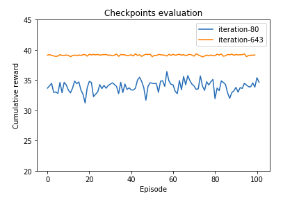

## Solution of the Reacher enviroment


Two training attempts, which differ only in learning rate: first one with `0.00005` and second with `0.0002`. Y axis of this graph is a scaled down value of the cumulative reward (not actual cumulative reward).

Training was done on the distributed version of the environment with 20 agents.

Proximal Policy Optimization algorithm was used. Key points:
* Both Continuous and Discreete action spaces are supported;
* Implemented [Generalized Advantage Estimation](https://arxiv.org/abs/1506.02438);
* Parallel computation of the GAE using Python `multiprocessing` module;
* Advantage Normalization;
* Whole experience buffer is used as a single batch during optimization stage. That allowed to keep code more simple and worked well on the current environments;

## Main Python files
* Implemetation of the PPO is in the [ppo.py](../rl/ppo.py). 
* Statistics storage and output to TensorBoard [stats.py](../rl/stats.py)
* Adapter for the Unity and OpenAI environments [env.py](../rl/env.py) makes single interface for interacting with them;
* Runner. Runs iterations, evaluation and training phases, single episodes. Combines together other components together. [runner.py](../rl/runner.py)
* Train [train.py](../train.py) and [play.py](../play.py) scripts are input points for training and playing a trained agents.

Separate benchmarks were done on the CartPole, LunarLander (both discreete and continuous versions) and Pendulum environments in order to make quick tests and make sure that algorithm correctly works on different range of tasks.

It was easier to first implement the PPO with the discreete action space. Then the GAE was implemented. When these parts was working the Continuous action space was added.

## Hyperparameters
* Learning rate: 0.0002
* Reward discount (gamma): 0.99
* PPO training epochs: 12
* PPO Epsilon. Defines how far can the optimized policy "go away" from the original policy: 0.2
* Horizon. How many timesteps should experience be collected before starting optimization phase: 128
* Number of simultaneously running agents: 20
* Batch size is equal to the whole buffer size: 20 agents * 128 horizon steps = 2560 samples per batch
* Lambda parameter for Advantage Function Estimation (GAE). This configures the impact of each n-step Advantage estimation into the resulting GAE value: 0.95

## Architecture
Only Fully Connected layers are used. Value head and action networks are completely separated. That makes the algorithm to converge faster and allows to avoid the task of adjusting weights of the Actor and Critic losses.

Critic network:

1. Middleware #1: `state_size` → 128; Leaky ReLU
2. Middleware #2: 128 → 128; Leaky ReLU
3. Value Head: 128 → 1

Actor network:

1. Middleware #1: `state_size` → 128; Leaky ReLU
2. Middleware #2: 128 → 128; Leaky ReLU
3. Action Head: 128 → `action_size`. In case of continuous environment the Tanh activation function is used and output is interpreted as `mu` value of Gaussian distribution. The `sigma` value of the distribution is read from the separate parameter of the network, which doesn't depend on the state.

## Trained agend


After training 80 iterations the agent reaches target score [33.9 on 100 episodes](./reacher-ppo-80-rewards.csv) (one iteration plays one episode). After training on 643 iterations agent reaches average score of [39.1 on 100 episodes](./reacher-ppo-643-rewards.csv). 



In order to run the trained agend, copy the saved network from the github to the local machine:

```
wget https://github.com/vladhc/rl-udacity/raw/master/p2_continuous/reacher-ppo-643.pth
```

and then run visualization:

```
python play.py --checkpoint reacher-ppo-643.pth
```

This renders the environment, runs multiple episodes and outputs the average reward.

## Other thoughts

* PPO appeared to be pretty stable (comparing to DQN). As soon, as bugs were fixed, it progressively trained on every environment nearly without hyperparameter tweaks from one env to another.
* I had problems implementing exploration in continous action space. If the variance of the action was depending on the state, the agent quickly stopped exploring, converging to local minimum. Entropy bonus is supposed to be used only in the discreete action set. Adding random noise to actions doesn't work either - it leads to divisions by zero in `R=new_P/old_p` coefficient calculation (there are always chances that action with noise has zero probability to be sampled under the current distribution). Adding small values to the denominator lead to permanent distortion of the policy. The only simple solution I found, was to make the variance a separate parameter of the network, which doesn't depend on the state. This allowed agent to spend more time exploring. If you know other relatively simple ways of making PPO agent explore - please let me know.
* Also having action variance as a separate parameter allowed to easier analyze what's happening with the network: if the network was performing good with high variance and the variance is decreasing, then stable improvement of the performance should be expected even if the reward graph doesn't go up for some time.
* Making parallel computation of GAE gave a good impact on the training process and allowed to develop and debug faster. I also tried to run parallel OpenAI environments, but that surprisingly slowed down the training speed. Most probably, the overhead on communication between processes discards the benefit of such optimization.

## Ideas for Future work
* Figure out other PPO exploration strategies;
* Solve the MountainCarContinous environment with the PPO. Interesting part is that the successful outcome is pretty rare in that environment. And, as the PPO doesn't have a replay buffer, this successful sample could be discarded and policy would converge to local minimum. That leads again to search for exploration strategies;
* Compare DDPG with PPO. At least by comparing benchmarks made by OpenAI. Understand the pros- and cons- of the DDPG and how it's compared to PPO.
* Solve Crawler environment.
